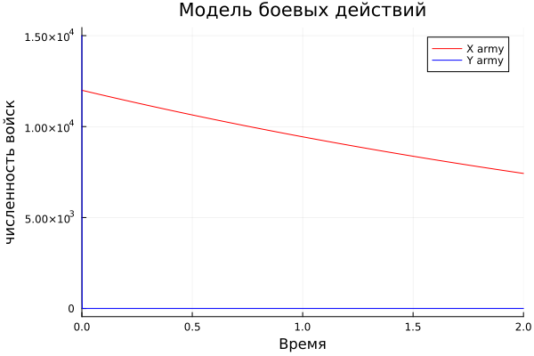
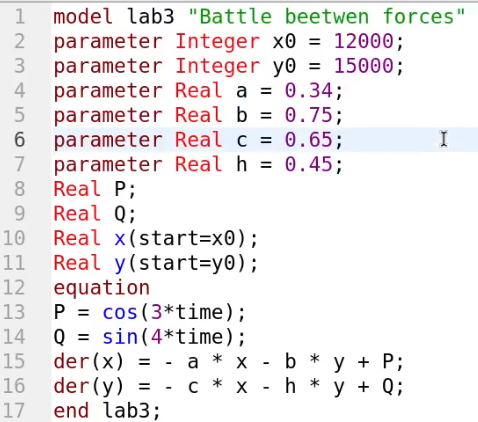
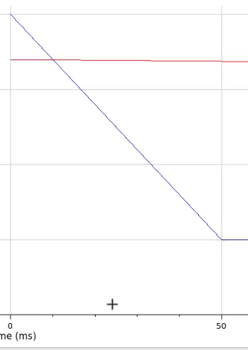

---
## Front matter
lang: ru-RU
title: Лабораторная работа 3
## subtitle: Простейший шаблон
author:
  - Купцов М.А.
institute:
  - Российский университет дружбы народов, Москва, Россия
date: 09 февраля 2023

## i18n babel
babel-lang: russian
babel-otherlangs: english

## Formatting pdf
toc: false
toc-title: Содержание
slide_level: 2
aspectratio: 169
section-titles: true
theme: metropolis
mainfont: DejaVu Serif
romanfont: DejaVu Serif
sansfont: DejaVu Sans
monofont: DejaVu Sans Mono
header-includes:
 - \metroset{progressbar=frametitle,sectionpage=progressbar,numbering=fraction}
 - '\makeatletter'
 - '\beamer@ignorenonframefalse'
 - '\makeatother'
---
## Цель работы

Построение графиков изменения численности войск армии Х и армии У для
следующих случаев:

1. Модель боевых действий между регулярными войсками.

2. Модель ведение боевых действий с участием регулярных войск и
партизанских отрядов.

## Задание

 - Написать код на Julia для моделирования вышеописанных случаев.
 - Написать код на OpenModelica для моделирования вышеописанных случаев.

## Выполнение лабораторной работы

1. Напишем реализацию модели боевых действий между регулярными войсками на языке Julia.

{#fig:001 width=30%}

## Выполнение лабораторной работы

2. Запустим код, мы получим на выходе фотографию с графиком уменьшения войск.

{#fig:002 width=50%}

## Выполнение лабораторной работы

3. Расмотрим модель боевых действий с участием регулярных войск и партизанских отрядов. Партизаны считаются менее уязвимыми, т.к. партизаны действуют скрытно.

{#fig:003 width=30%}

## Выполнение лабораторной работы

4. Запустив код, мы получим на выходе фотографию с графиком уменьшения войск.

{#fig:004 width=50%}

## Выполнение лабораторной работы

5. Теперь перейдем к реализации на OpenModelica

## Выполнение лабораторной работы

6. Напишем реализацию модели боевых действий между регулярными войсками.

{#fig:005 width=30%}

## Выполнение лабораторной работы

7. Запустим код, мы получим на выходе фотографию с графиком уменьшения войск.

{#fig:006 width=50%}

## Выполнение лабораторной работы

8. Расмотрим модель боевых действий с участием регулярных войск и партизанских отрядов. Партизаны считаются менее уязвимыми, т.к. партизаны действуют скрытно.

{#fig:007 width=30%}

## Выполнение лабораторной работы

9. Запустив код, мы получим на выходе фотографию с графиком уменьшения войск.

{#fig:008 width=20%}

# Выводы

По мере выполнения данной работы, я смоделировал численность различных типов войск во время военных действий на языках Julia и OpenModelica.

## Библиография

1. Modelica Documentation. // Электронный ресурс, 

URL: https://build.openmodelica.org/Documentation/

2. Julia DifferentialEquations.jl Documentation. // Электронный ресурс, 

URL: https://docs.sciml.ai/DiffEqDocs/stable/types/ode_types/

