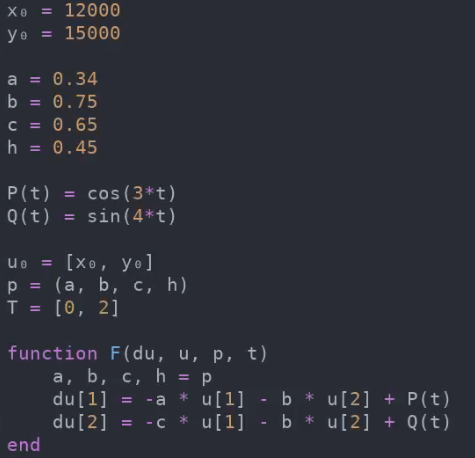
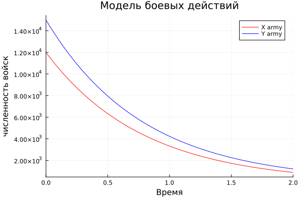
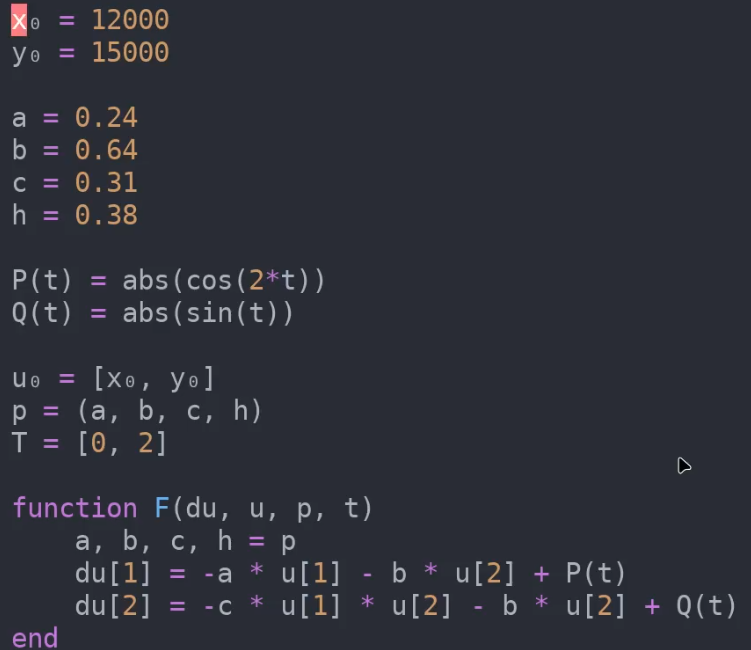
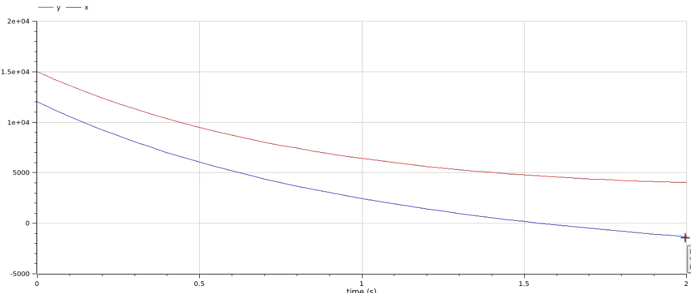
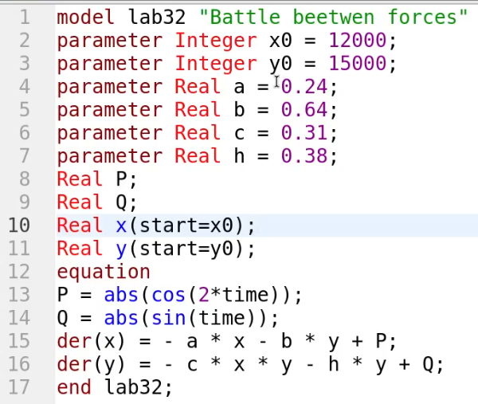

---
## Front matter
title: "Лабораторная работа 3"
##subtitle: "Простейший вариант"
author: "Купцов Максим Ахмедович"

## Generic otions
lang: ru-RU
toc-title: "Содержание"

## Bibliography
bibliography: bib/cite.bib
csl: pandoc/csl/gost-r-7-0-5-2008-numeric.csl

## Pdf output format
toc: true # Table of contents
toc-depth: 2
lof: true # List of figures
lot: true # List of tables
fontsize: 12pt
linestretch: 1.5
papersize: a4
documentclass: scrreprt
## I18n polyglossia
polyglossia-lang:
  name: russian
  options:
	- spelling=modern
	- babelshorthands=true
polyglossia-otherlangs:
  name: english
## I18n babel
babel-lang: russian
babel-otherlangs: english
## Fonts
mainfont: DejaVu Serif
romanfont: DejaVu Serif
sansfont: DejaVu Sans
monofont: DejaVu Sans Mono
mainfontoptions: Ligatures=TeX
romanfontoptions: Ligatures=TeX
sansfontoptions: Ligatures=TeX,Scale=MatchLowercase
monofontoptions: Scale=MatchLowercase,Scale=0.9
## Biblatex
biblatex: true
biblio-style: "gost-numeric"
biblatexoptions:
  - parentracker=true
  - backend=biber
  - hyperref=auto
  - language=auto
  - autolang=other*
  - citestyle=gost-numeric
## Pandoc-crossref LaTeX customization
figureTitle: "Рис."
tableTitle: "Таблица"
listingTitle: "Листинг"
lofTitle: "Список иллюстраций"
lotTitle: "Список таблиц"
lolTitle: "Листинги"
## Misc options
indent: true
header-includes:
  - \usepackage{indentfirst}
  - \usepackage{float} # keep figures where there are in the text
  - \floatplacement{figure}{H} # keep figures where there are in the text
---

# Цель работы

Построение графиков изменения численности войск армии Х и армии У для
следующих случаев:
1. Модель боевых действий между регулярными войсками.
2. Модель ведение боевых действий с участием регулярных войск и
партизанских отрядов.

# Задание

 - Написать код на Julia для моделирования вышеописанных случаев.
 - Написать код на OpenModelica для моделирования вышеописанных случаев.

# Выполнение лабораторной работы

1. Напишем реализацию модели боевых действий между регулярными войсками на языке Julia.

{#fig:001 width=50%}

2. Запустим код, мы получим на выходе фотографию с графиком уменьшения войск.

{#fig:002 width=50%}

3. Расмотрим модель боевых действий с участием регулярных войск и партизанских отрядов. Партизаны считаются менее уязвимыми, т.к. партизаны действуют скрытно.

{#fig:003 width=50%}

4. Запустив код, мы получим на выходе фотографию с графиком уменьшения войск.

{#fig:004 width=50%}

5. Теперь перейдем к реализации на OpenModelica

6. Напишем реализацию модели боевых действий между регулярными войсками.

{#fig:005 width=50%}

7. Запустим код, мы получим на выходе фотографию с графиком уменьшения войск.

{#fig:006 width=50%}

8. Расмотрим модель боевых действий с участием регулярных войск и партизанских отрядов. Партизаны считаются менее уязвимыми, т.к. партизаны действуют скрытно.

{#fig:007 width=50%}

9. Запустив код, мы получим на выходе фотографию с графиком уменьшения войск.

{#fig:008 width=50%}

# Выводы

По мере выполнения данной работы, я смоделировал численность различных типов войск во время военных действий на языках Julia и OpenModelica.

# Библиография

1. Modelica Documentation. // Электронный ресурс, 

URL: https://build.openmodelica.org/Documentation/

2. Julia DifferentialEquations.jl Documentation. // Электронный ресурс, 

URL: https://docs.sciml.ai/DiffEqDocs/stable/types/ode_types/
