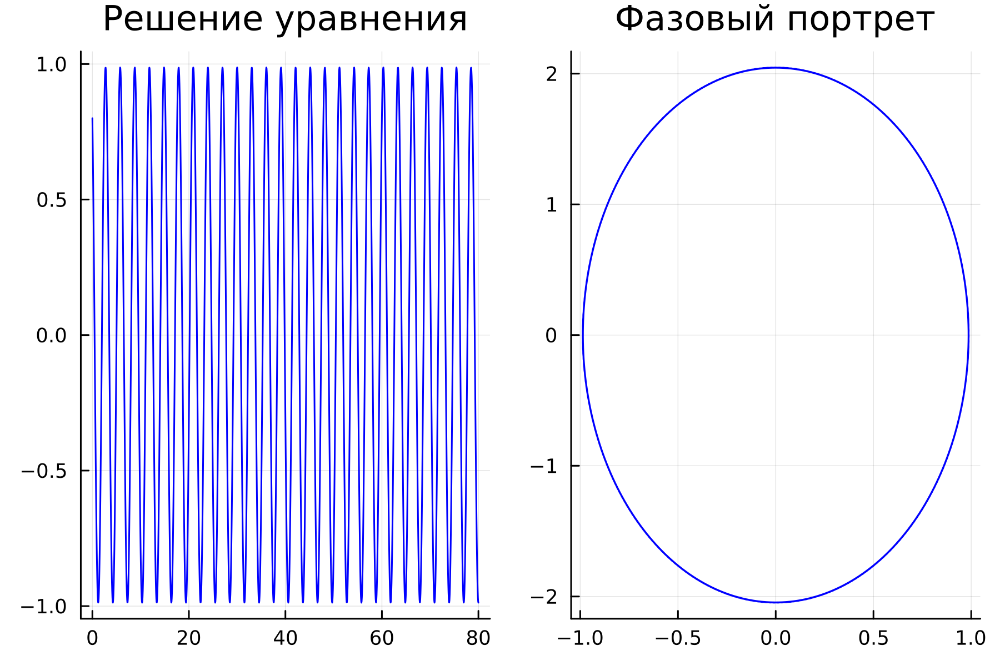
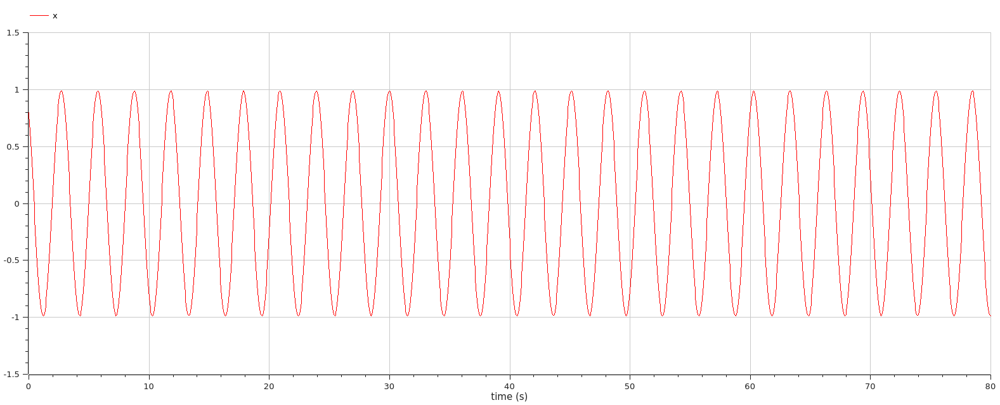
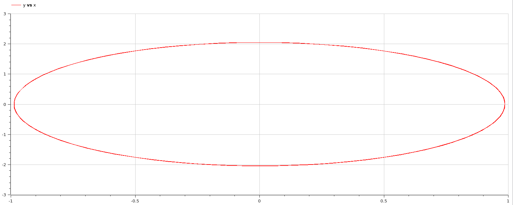
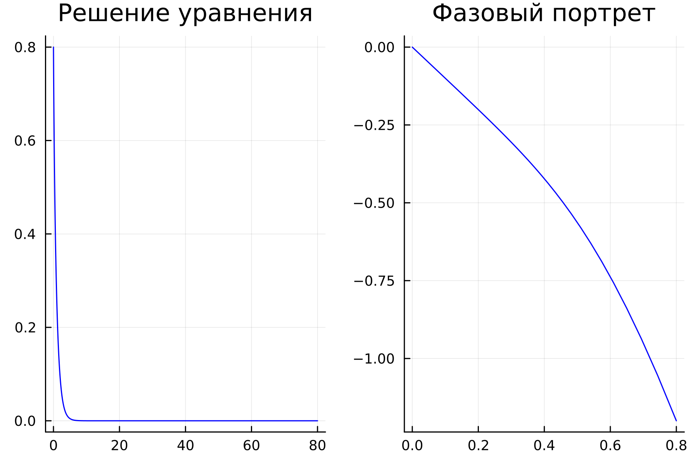
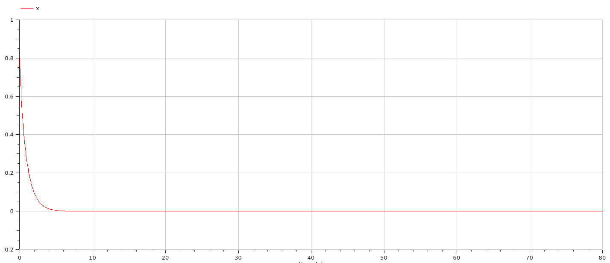
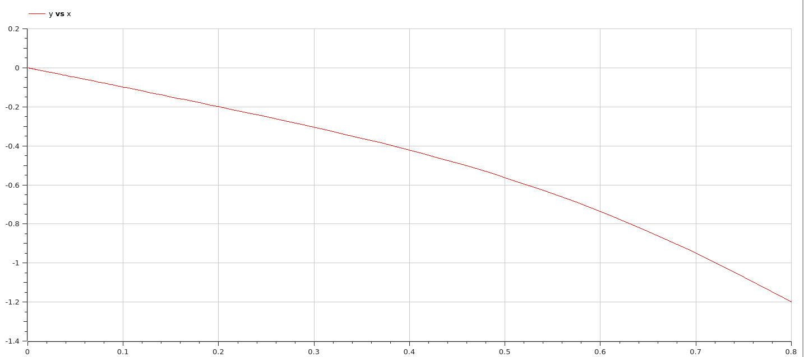
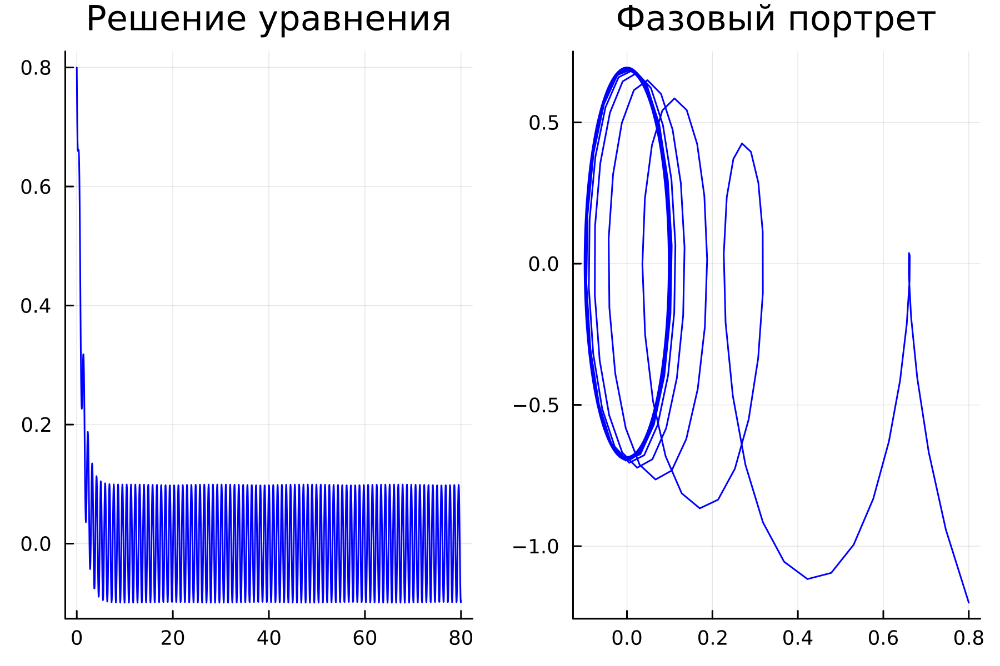
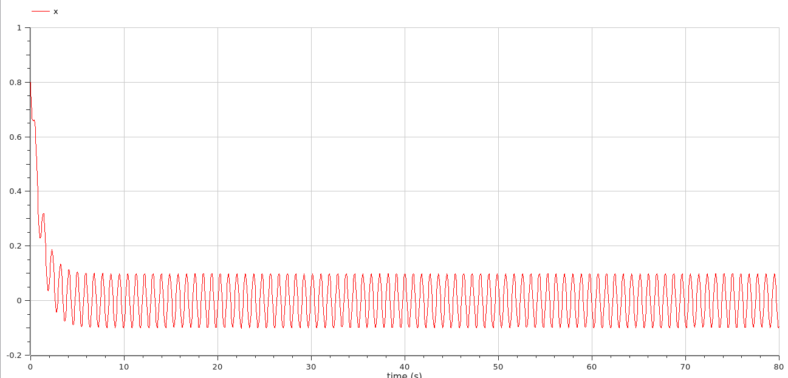
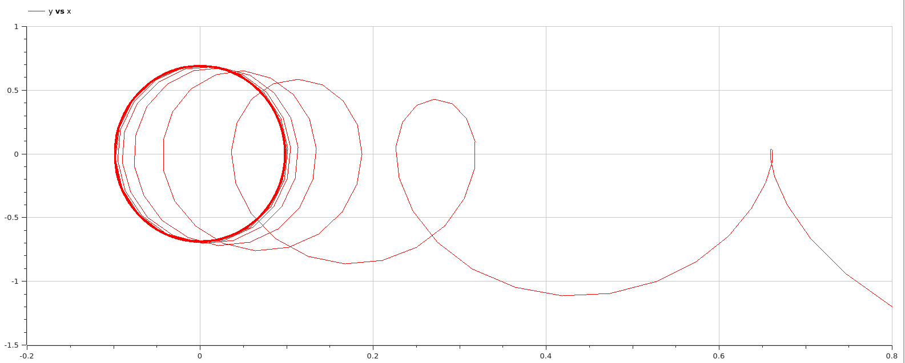

---
## Front matter
title: "Лабораторная работа 4"
##subtitle: "Простейший вариант"
author: "Купцов Максим Ахмедович"

## Generic otions
lang: ru-RU
toc-title: "Содержание"

## Bibliography
bibliography: bib/cite.bib
csl: pandoc/csl/gost-r-7-0-5-2008-numeric.csl

## Pdf output format
toc: true # Table of contents
toc-depth: 2
lof: true # List of figures
lot: true # List of tables
fontsize: 12pt
linestretch: 1.5
papersize: a4
documentclass: scrreprt
## I18n polyglossia
polyglossia-lang:
  name: russian
  options:
	- spelling=modern
	- babelshorthands=true
polyglossia-otherlangs:
  name: english
## I18n babel
babel-lang: russian
babel-otherlangs: english
## Fonts
mainfont: DejaVu Serif
romanfont: DejaVu Serif
sansfont: DejaVu Sans
monofont: DejaVu Sans Mono
mainfontoptions: Ligatures=TeX
romanfontoptions: Ligatures=TeX
sansfontoptions: Ligatures=TeX,Scale=MatchLowercase
monofontoptions: Scale=MatchLowercase,Scale=0.9
## Biblatex
biblatex: true
biblio-style: "gost-numeric"
biblatexoptions:
  - parentracker=true
  - backend=biber
  - hyperref=auto
  - language=auto
  - autolang=other*
  - citestyle=gost-numeric
## Pandoc-crossref LaTeX customization
figureTitle: "Рис."
tableTitle: "Таблица"
listingTitle: "Листинг"
lofTitle: "Список иллюстраций"
lotTitle: "Список таблиц"
lolTitle: "Листинги"
## Misc options
indent: true
header-includes:
  - \usepackage{indentfirst}
  - \usepackage{float} # keep figures where there are in the text
  - \floatplacement{figure}{H} # keep figures where there are in the text
---

# Цель работы

1. Построить решение уравнения гармонического осциллятора без затухания
2. Записать уравнение свободных колебаний гармонического осциллятора с затуханием, построить его решение. Построить фазовый портрет гармонических колебаний с затуханием.
3. Записать уравнение колебаний гармонического осциллятора, если на систему действует внешняя сила, построить его решение. Построить фазовый портрет колебаний с действием внешней силы.

# Задание

Постройте фазовый портрет гармонического осциллятора и решение уравнения
гармонического осциллятора для следующих случаев

1. Колебания гармонического осциллятора без затуханий и без действий внешней силы $$\ddot{x}+4.3x=0$$
2. Колебания гармонического осциллятора c затуханием и без действий внешней силы $$\ddot{x}+6\dot{x} + 5x=0$$
3. Колебания гармонического осциллятора c затуханием и под действием внешней силы $$\ddot{x}+10\dot{x} + 9x=8sin(7t)$$
На интервал $t \in [0; 80]$ (шаг 0.05) с начальными условиями $x_{0} = 0.8, y_{0} = -1.2$

# Выполнение лабораторной работы

## Колебания гармонического осциллятора без затуханий и без действий внешней силы

1. Зададим изначальные значения для решения варианта.

~~~julia
w = 4.3
g = 0.0
x₀ = 0.8
y₀ = -1.2
tspan = (0.0, 80.0)
~~~

2. Зададим наше уравнение для нахождения фазового портрета и решения уравнения на языке Julia (Полный исходный код представлен в репозитории @julia:task1) 

~~~julia
function ode_fn(du, u, p, t)
  x, y = u
  du[1] = u[2]
  du[2] = -w*u[1] - g*u[2]
end
~~~

3. Сохраним наш график в файл и посмотрим, что в нем хранится (рис. @fig:001).

{#fig:001 width=50%}

4. Расмотрим решение на OpenModelica (Полный исходный код представлен в репозитории @om:task1). 

5. Здесь мы получаем аналогичное решение (@fig:011) и аналогичный фазовый портрет (@fig:012).

{#fig:011 width=50%}

{#fig:012 width=50%}

## Колебания гармонического осциллятора c затуханием и без действий внешней силы

1. Зададим изначальные значения для решения варианта.

~~~julia
w = 5.0
g = 6.0
x₀ = 0.8
y₀ = -1.2
tspan = (0.0, 80.0)
~~~

2. Зададим наше уравнение для нахождения фазового портрета и решения уравнения на языке Julia (Аналигчное тому, что было в коде из пунтка ранее. Полный исходный код представлен в репозитории @julia:task2)

3. Сохраним наш график в файл и посмотрим, что в нем хранится (рис. @fig:002).

{#fig:002 width=50%}

4. Расмотрим решение на OpenModelica (Полный исходный код представлен в репозитории @om:task2). 

5. Здесь мы получаем аналогичное решение (@fig:013) и аналогичный фазовый портрет (@fig:014).

{#fig:013 width=50%}

{#fig:014 width=50%}

## Колебания гармонического осциллятора c затуханием и под действием внешней силы

1. Зададим изначальные значения для решения варианта.

~~~julia
w = 9.0
g = 10.0
x₀ = 0.8
y₀ = -1.2
tspan = (0.0, 80.0)
~~~

2. Зададим наше уравнение для нахождения фазового портрета и решения уравнения на языке Julia (Полный исходный код представлен в репозитории @julia:task3) 

~~~julia
function ode_fn(du, u, p, t)
  x, y = u
  du[1] = u[2]
  du[2] = -w*u[1] - g*u[2] + 8*sin(7*t) 
end
~~~

3. Сохраним наш график в файл и посмотрим, что в нем хранится (рис. @fig:003).

{#fig:003 width=50%}

4. Расмотрим решение на OpenModelica (Полный исходный код представлен в репозитории @om:task3). 

5. Здесь мы получаем аналогичное решение (@fig:015) и аналогичный фазовый портрет (@fig:016).

{#fig:015 width=50%}

{#fig:016 width=50%}

# Выводы

Результатом работы стали по три модели в Julia и OpenModelica: конструкция модели колебаний в OpenModelica содержит меньше строк, чем аналогичная конструкция в Julia.

# Библиография

